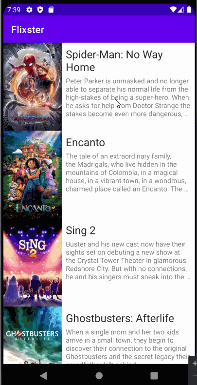

# Flixster

*Flixster* is a movie browsing app that allows users to browse movies currently playing in theaters.

## Features

The following functionality is completed:
- [ ] **Make a request to [The Movie Database API's `now_playing`](https://developers.themoviedb.org/3/movies/get-now-playing) endpoint to get a list of current movies**
- [ ] **Parse through JSON data and implement a RecyclerView to display all movies**
- [ ] **Use Glide to load and display movie poster images**

- [x] Expose details of movie (ratings using RatingBar, popularity, and synopsis) in a separate activity.
- [x] Allow video posts to be played in full-screen using the YouTubePlayerView.
- [x] User can view a list of movies (title, poster image, and overview) currently playing in theaters from the Movie Database API.

Optional:
- [ ] Improve and customize the user interface through styling and coloring
- [ ] Implement orientation responsivity
  - App should neatly arrange data in both landscape and portrait mode
- [ ] Implement Glide to display placeholder graphics during loading
  - Note: this feature is difficult to capture in a GIF without throttling internet speeds.  Instead, include an additional screencap of your Glide code implementing the feature.  (<10 lines of code)

#### To-do Stories

- [ ] Implement a shared element transition when user clicks into the details of a movie.
- [ ] Trailers for popular movies are played automatically when the movie is selected.
  - [ ] When clicking on a popular movie (i.e. a movie voted for more than 5 stars) the video should be played immediately.
  - [ ] Less popular videos rely on the detailed page should show an image preview that can initiate playing a YouTube video.
- [ ] Add a play icon overlay to popular movies to indicate that the movie can be played. 
- [ ] Apply data binding for views to help remove boilerplate code.
- [ ] Add a rounded corners for the images using the Glide transformations.
- [ ] Views should be responsive for both landscape/portrait mode.
   - [ ] In portrait mode, the poster image, title, and movie overview is shown.
   - [ ] In landscape mode, the rotated alternate layout should use the backdrop image instead and show the title and movie overview to the right of it.
- [ ] Display a nice default [placeholder graphic](https://guides.codepath.org/android/Displaying-Images-with-the-Glide-Library#advanced-usage) for each image during loading
- [ ] Improved the user interface by experimenting with styling and coloring.
- [ ] For popular movies (i.e. a movie voted for more than 5 stars), the full backdrop image is displayed. Otherwise, a poster image, the movie title, and overview is listed. Use Heterogenous RecyclerViews and use different ViewHolder layout files for popular movies and less popular ones.

## Video Walkthrough

GIF created with LICEcap

## Open-source libraries used
- [Android Async HTTP](https://github.com/codepath/CPAsyncHttpClient) - Simple asynchronous HTTP requests with JSON parsing
- [Glide](https://github.com/bumptech/glide) - Image loading and caching library for Android

## License

    Copyright [yyyy] [name of copyright owner]

    Licensed under the Apache License, Version 2.0 (the "License");
    you may not use this file except in compliance with the License.
    You may obtain a copy of the License at

        http://www.apache.org/licenses/LICENSE-2.0

    Unless required by applicable law or agreed to in writing, software
    distributed under the License is distributed on an "AS IS" BASIS,
    WITHOUT WARRANTIES OR CONDITIONS OF ANY KIND, either express or implied.
    See the License for the specific language governing permissions and
    limitations under the License.
